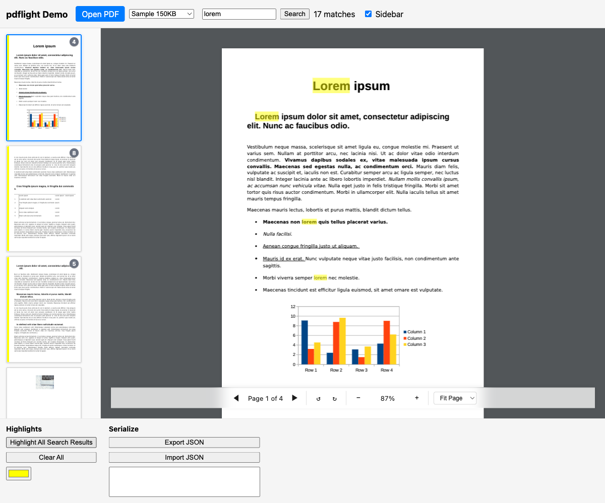

# pdflight

PDF viewer library with precise text highlighting and smart search.



## Features

- **Precise text highlighting** — overlays that accurately cover rendered text using font-metrics-based character positioning
- **Smart search** — handles subscripts, superscripts, hyphenated words, cross-column text, and fragmented text spans
- **Framework-agnostic** — vanilla TypeScript, works with any framework
- **Bundled pdf.js** — includes pdf.js as a direct dependency, no peer deps

## Quick Start

```typescript
import { PdfViewer } from 'pdflight';

const viewer = new PdfViewer(containerElement);
await viewer.load('/path/to/document.pdf');

// Search
const matches = await viewer.search('search term');

// Highlight
viewer.addHighlights(matches.map((m, i) => ({
  id: `h-${i}`,
  page: m.page,
  startChar: m.startChar,
  endChar: m.endChar,
  color: 'rgba(255, 255, 0, 0.5)',
})));
```

## Demo

Run `bun run dev` and open http://localhost:5173 to see the demo app exercising all features.

## Development

```bash
bun install          # Install dependencies
bun run build        # Build the library
bun run dev          # Start dev server with demo app
bun run test         # Run unit tests
bun run test:coverage # Run tests with coverage
bun run lint         # ESLint check
bun run typecheck    # TypeScript type checking
bun run test:e2e     # Run Playwright browser tests
```

## How It Works

### Smart Search

pdflight builds a normalized text index from pdf.js's `getTextContent()` data:
1. Concatenates all text items into a single searchable string
2. Maps each character back to its source text item and position
3. Normalizes whitespace, rejoins hyphens, handles unicode

### Precise Highlighting

Unlike solutions that use DOM measurement, pdflight computes highlights from pdf.js's glyph-level position data:
1. Computes bounding rectangles from each text item's `transform` matrix, with descender adjustment for characters like p, g, y
2. Uses per-character widths from pdf.js font objects for precise partial-word highlighting
3. Handles page rotation by transforming PDF-space rects to match the rotated viewport
4. Merges adjacent rectangles on the same line for efficient DOM rendering
5. Survives zoom/pan/resize/rotation by recomputing from source data — no DOM measurement needed

## License

MIT
