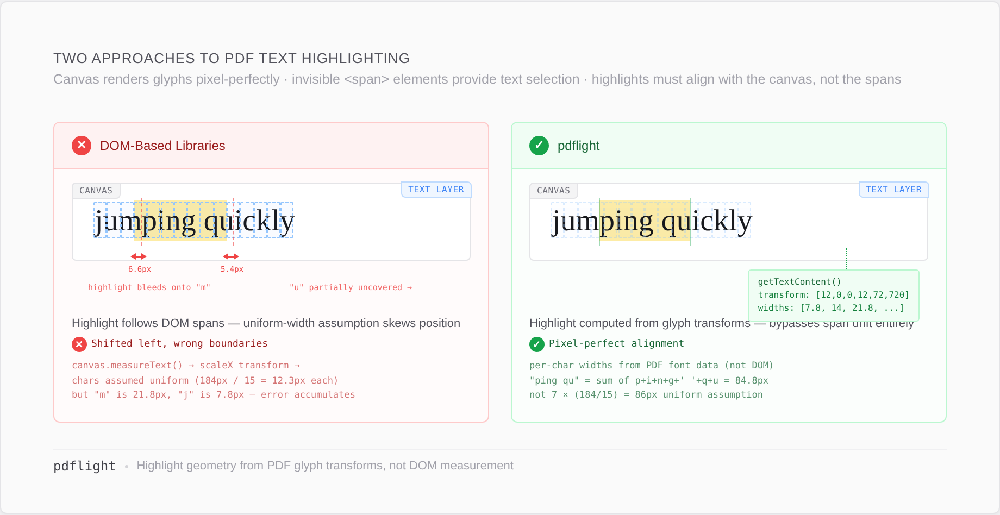
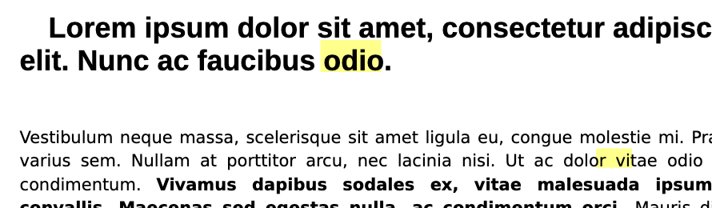
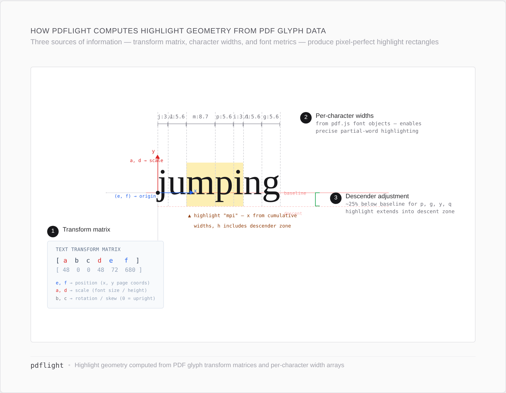
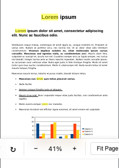
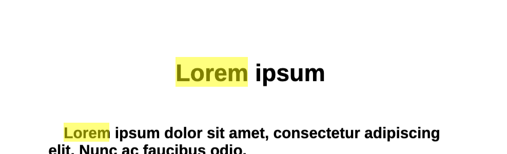
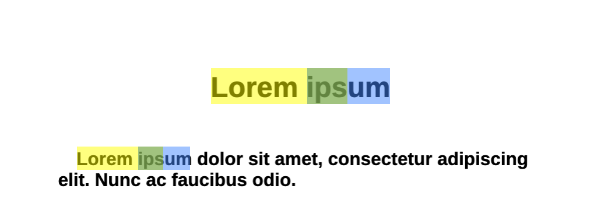

# Why pdflight?

We surveyed every JavaScript PDF highlighting library we could find — open-source and commercial. The commercial SDKs (PSPDFKit, Apryse) solve highlight accuracy by owning the entire rendering engine. Every open-source alternative positions highlights by measuring the DOM text layer that pdf.js renders on top of the canvas. This works *most of the time*, but breaks in ways that are hard to debug and impossible to fix from the outside.

pdflight is the only non-commercial JavaScript library that produces accurate text highlights. It takes a different approach entirely.

## The problem with DOM-based highlighting

pdf.js renders PDF pages in two layers:

1. **Canvas** — pixel-perfect rendering of the actual PDF glyphs
2. **Text layer** — invisible `` elements positioned over the canvas for text selection and accessibility

The text layer spans are positioned using `canvas.measureText()` to compute a `scaleX` CSS transform. When the measurement font differs from the rendered font — which happens depending on OS, browser, zoom level, and locale — the spans drift away from the actual glyphs. This is a [well-documented](https://github.com/mozilla/pdf.js/issues/20017), [long-standing](https://github.com/mozilla/pdf.js/issues/7878) problem in pdf.js with [multiple](https://bugzilla.mozilla.org/show_bug.cgi?id=1815391) [open](https://bugzilla.mozilla.org/show_bug.cgi?id=1922063) bug reports spanning over a decade.

Every library that measures DOM elements to position highlights — `getClientRects()`, `getBoundingClientRect()`, or CSS class injection on text layer spans — inherits this drift.

Here's a real example — searching for "odio" and highlighting with DOM-measured rectangles. The first highlight bleeds well below the text baseline; the second is pushed to the far right of the line, barely covering the target word:

### Errors compound

The drift isn't a constant offset you can correct for. Each text span's error depends on the specific characters it contains, the font metrics the browser resolved, and the `scaleX` transform pdf.js computed. Across a line of text, these per-span errors accumulate: a 1px drift on the first span shifts every subsequent span's starting position. By the end of a long line — or across multiple lines in a dense paragraph — highlights can land several pixels away from the actual text. At higher zoom levels the errors scale proportionally, making the misalignment even more obvious. The result is highlights that look roughly right at a glance but fall apart under closer inspection, especially on documents with mixed fonts, small text, or tight line spacing.

## How pdflight positions highlights

pdflight bypasses the text layer DOM entirely. It reads the same source data pdf.js uses to render canvas glyphs — the `getTextContent()` API — and computes highlight geometry directly from:

- **Transform matrices** (`[a, b, c, d, e, f]`) that encode each text item's position, scale, and rotation
- **Per-character widths** from pdf.js font objects, enabling precise partial-word highlighting
- **Descender adjustment** (~25% below baseline) for characters like p, g, y, q

The result: highlights land exactly where the text is rendered, regardless of OS font resolution, zoom level, or text layer drift.

### Accurate at every zoom level

Full page view — "Lorem" highlighted across different font sizes (title, subtitle, body):

Zoomed to 154% — the highlight precisely covers the text with no drift:

Overlapping highlights with color blending — "Lorem ips" in yellow, "ipsum" in blue. Where they overlap on "ips", the colors blend to green:

## The text fragmentation problem

pdf.js splits text into items arbitrarily. A single word might be one item, or three. A line might be one item, or twenty. This fragmentation depends on the PDF producer, font encoding, and internal optimization choices. You can't predict or control it.

This creates two problems:

1. **Search fails across item boundaries** — searching for "H2O" won't find it if "H", "2", and "O" are separate items (common with subscripts)
2. **Highlights can't span fragments** — if your highlight range crosses an item boundary, DOM-based libraries either miss the gap or produce misaligned rectangles

pdflight solves both by building a **normalized text index**: all text items on a page are concatenated into a single flat string with a parallel array mapping each character back to its source item and position. Search operates on the flat string; results map back through the index to compute geometry from the original transform data.

This index also handles:
- **Hyphenated line breaks** — `cap-\ntion` is rejoined as `caption`
- **Subscripts and superscripts** — detected via y-offset differences between consecutive items
- **Whitespace normalization** — collapsed for consistent matching

## Comparison

| | Positioning method | Cross-item search | Hyphenation | Sub/superscripts | Framework | License |
|---|---|---|---|---|---|---|
| **pdflight** | `getTextContent()` transform matrices + per-char font widths | Yes (normalized index) | Yes | Yes | Agnostic | MIT |
| **pdf.js built-in** | CSS class on text layer spans | Internal only (not exposed) | Yes (since 2022) | No | Agnostic | Apache 2.0 |
| **react-pdf-highlighter** | `getClientRects()` on DOM selection | No search engine | No | No | React | MIT |
| **@react-pdf-viewer/highlight** | Percentage rects from DOM selection | No search engine | No | No | React | MIT |
| **ngx-extended-pdf-viewer** | Delegates to pdf.js text layer | Via pdf.js only | Inherited | No | Angular | MIT |
| **vue-pdf-embed / VuePDF** | Delegates to pdf.js text layer | Via pdf.js only | Inherited | No | Vue 3 | MIT |
| **Nutrient (PSPDFKit)** | Proprietary WASM engine, PDF-native coords | Yes | Yes | Proprietary | Agnostic | Commercial |
| **Apryse (PDFTron)** | Proprietary WASM engine, PDF-native coords | Yes | Yes | Proprietary | Agnostic | Commercial |

## The short version

- **vs. open-source alternatives**: pdflight is the only open-source library that computes highlight geometry from glyph-level data rather than DOM measurement. It's also the only one with a normalized text index that enables search across text fragmentation boundaries, and it works with any framework.
- **vs. commercial SDKs** (Nutrient, Apryse): these solve the same accuracy problem by owning the entire PDF rendering engine (WASM-based, not pdf.js). They're more feature-complete but cost significant licensing fees. pdflight builds on top of pdf.js and is free.
