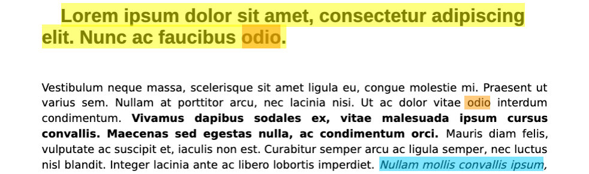
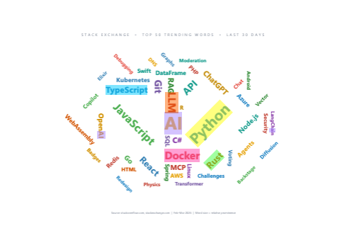

# Why pdflight?

I'm using LLMs now to do deep research on text documents. A few years ago, this would have been much more challenging. But how do we fact-check? Asking an LLM to provide citations into the document in the prompt is easy: the user can fact-check the sources within the document. Building a UI that allows users to view and navigate between these citations, and highlights them, seems like an obvious choice.

```text
Cite every claim with an inline reference [page, line, quote].
Do not cite any facts without a source.
...
```

Attempting to build this capability in a UI we ran into challenges. The open source PDF tools would put highlights on the page, but often only near the actual text.  The more complex the formatting of the page, the worse results we found. 

I surveyed every JavaScript PDF highlighting library I could find — open-source and commercial. The commercial SDKs (PSPDFKit, Apryse) solve highlight accuracy by owning the entire rendering engine. Every open-source alternative positions highlights by measuring the DOM text layer that pdf.js renders on top of the canvas. This works *most of the time*, but breaks in ways that are hard to debug and impossible to fix from the outside.  

I don't want to be tied to a commercial solution. I'm not an expert at PDF, but working with Claude to investigate the issues, it seemed this might be doable with some LLM help and a great deal of testing. This felt like an opportunity to help the community out with a better solution to PDF highlighting and searching. 

The result is pdflight, the only non-commercial JavaScript library that produces accurate text highlights. It takes a different approach entirely.

## The problem with DOM-based highlighting

pdf.js renders PDF pages in two layers:

1. **Canvas** — pixel-perfect rendering of the actual PDF glyphs
2. **Text layer** — invisible `<span>` elements positioned over the canvas for text selection and accessibility

The text layer spans are positioned using `canvas.measureText()` to compute a `scaleX` CSS transform. When the measurement font differs from the rendered font — which happens depending on OS, browser, zoom level, and locale — the spans drift away from the actual glyphs. This is a [well-documented](https://github.com/mozilla/pdf.js/issues/20017), [long-standing](https://github.com/mozilla/pdf.js/issues/7878) problem in pdf.js with [multiple](https://bugzilla.mozilla.org/show_bug.cgi?id=1815391) [open](https://bugzilla.mozilla.org/show_bug.cgi?id=1922063) bug reports spanning over a decade.


Every library that measures DOM elements to position highlights — `getClientRects()`, `getBoundingClientRect()`, or CSS class injection on text layer spans — inherits this drift.

### Errors compound

The drift isn't a constant offset you can correct for. Each text span's error depends on the specific characters it contains, the font metrics the browser resolved, and the `scaleX` transform pdf.js computed. Across a line of text, these per-span errors accumulate: a 1px drift on the first span shifts every subsequent span's starting position. 

Proportional fonts, italics, subscripts and superscripts, mixed fonts on a row all compound. Because fonts change across the document, easy assumptions about line heights and font widths are traps that must be avoided.

By the end of a long line — or across multiple lines in a dense paragraph — highlights can land several pixels away from the actual text. At higher zoom levels the errors scale proportionally, making the misalignment even more obvious. The result is highlights that look roughly right at a glance but fall apart under closer inspection, especially on documents with mixed fonts, small text, or tight line spacing.


## How pdflight positions highlights

pdflight bypasses the text layer DOM entirely. It reads the same source data pdf.js uses to render canvas glyphs — the `getTextContent()` API — and computes highlight geometry directly from:

- **Transform matrices** (`[a, b, c, d, e, f]`) that encode each text item's position, scale, and rotation
- **Per-character widths** from pdf.js font objects, enabling precise partial-word highlighting
- **Descender adjustment** (~25% below baseline) for characters like p, g, y, q


The result: highlights land exactly where the text is rendered, regardless of OS font resolution, zoom level, or text layer drift.

### Accurate at every zoom level

Full page view — "Lorem" highlighted across different font sizes (title, subtitle, body):


Zoomed to 154% — the highlight precisely covers the text with no drift:


Overlapping highlights with color blending — "Lorem ips" in yellow, "ipsum" in blue. Where they overlap on "ips", the colors blend to green:


## The text fragmentation problem

pdf.js splits text into items arbitrarily. A single word might be one item, or three. A line might be one item, or twenty. This fragmentation depends on the PDF producer, font encoding, and internal optimization choices. You can't predict or control it.

This creates two problems:

1. **Search fails across item boundaries** — searching for "H2O" won't find it if "H", "2", and "O" are separate items (common with subscripts)
2. **Highlights can't span fragments** — if your highlight range crosses an item boundary, DOM-based libraries either miss the gap or produce misaligned rectangles

pdflight solves both by building a **normalized text index**: all text items on a page are concatenated into a single flat string with a parallel array mapping each character back to its source item and position. Search operates on the flat string; results map back through the index to compute geometry from the original transform data.

This index also handles:
- **Hyphenated line breaks** — `cap-\ntion` is rejoined as `caption`
- **Subscripts and superscripts** — detected via y-offset differences between consecutive items
- **Whitespace normalization** — collapsed for consistent matching

## Handling italic and rotated text

### Italic text

PDFs encode italic text not by selecting an italic font face, but by applying a **skew transform** to the text matrix. Each text item's transform is a 6-element array `[scaleX, skewY, skewX, scaleY, tx, ty]` — the `skewX` component controls the italic slant (typically ~2.8 for standard italic).

The naïve approach is to compute the text item's effective size from the full transform matrix using the Euclidean norm: `√(scaleX² + skewY²)` for horizontal scale and `√(scaleY² + skewX²)` for vertical. This is mathematically correct for determining the overall scaling of a vector through the transform — but it's wrong for positioning highlights, because **skew does not affect glyph advance widths**. An italic "m" leans to the right but occupies the same horizontal space as an upright "m".

pdflight uses only the diagonal scale components to compute the width ratio:

```
scaleRatioX = |scaleX| / |scaleY|
```

This means italic text highlights are the correct width — they don't shrink by 3–4% as they would if skew were factored into the ratio. The descender depth (for characters like p, g, y) is similarly derived from `|scaleY|` alone, not from the full vertical norm.



### Rotated text items (word clouds, labels)

Some PDFs contain individually rotated text items — words placed at arbitrary angles, common in word clouds, infographics, and chart labels. Each item's transform matrix encodes the rotation: a standard horizontal word has transform `[12, 0, 0, 12, x, y]` (b=0, no rotation), while a word rotated 90° clockwise has `[0, -26, 26, 0, x, y]` (a=0, b≠0).

The naïve approach — using only the diagonal elements `scaleX` and `scaleY` — produces zero-size rectangles when both are zero (pure rotation). pdflight decomposes the full transform matrix:

```
rotation = atan2(b, a)
xScale   = √(a² + b²)    // scale along text direction
yScale   = √(c² + d²)    // scale perpendicular to text
```

When `|rotation| < ε`, the code falls back to the diagonal-only extraction for backward compatibility with horizontal and italic text. For non-zero rotation, the decomposition produces a `RotatedRect` — a rectangle with a rotation angle in the text's local frame.

The descender depth (for characters like p, g, y) extends perpendicular to the text baseline. For horizontal text that's straight down `(0, -1)`, but for rotated text it's `(sin θ, -cos θ)` in world coordinates — the unit vector `(0, -1)` rotated by angle θ.

The CSS highlight div receives `transform-origin: 0 0` and `transform: rotate(Xdeg)`, with the rotation angle negated to convert from PDF's counterclockwise convention to CSS's clockwise convention. The pivot point (CSS top-left corner) is computed from the PDF bottom-left origin by walking along the height vector: `x_css = (x_pdf - height × sin θ) × scale`.



### Rotated pages

PDF page rotation is separate from the text content coordinate system. When a page is rotated 90°, 180°, or 270°, the text items from `getTextContent()` are still reported in the **original unrotated coordinate space**, but the rendered viewport uses the rotated coordinates.

pdflight bridges this gap with `rotatePdfRect()`, which transforms each highlight rectangle from the original PDF space into the rotated viewport space:

- **90° CW**: x-axis maps to rotated y-axis (inverted), y-axis maps to rotated x-axis, width and height swap
- **180°**: both axes invert, no width/height swap
- **270° CW**: inverse of 90°

This rotation is applied after computing the rectangle from the text transform and before converting from PDF coordinates (origin bottom-left, y-up) to CSS coordinates (origin top-left, y-down). The result: highlights remain accurate regardless of page rotation, and a full 360° round-trip (four successive 90° rotations) returns to the original rectangle.

When page rotation and item-level rotation combine (e.g. a word cloud on a rotated page), the page rotation transforms only the origin point of each `RotatedRect`, and the page rotation angle is added to the item's rotation. Width and height stay in the rect's local frame — unlike axis-aligned rects, which swap width and height at 90° and 270°.

## Row-addressable text

PDFs have no native "line" or "row" concept — text items are positioned at arbitrary coordinates. But external systems often reference text by location: an LLM returns "Invoice total on page 3, line 5", or a search engine returns page-level results that need to be anchored to a specific region.

pdflight bridges this gap with a row index that clusters text items into visual rows by y-coordinate proximity (within half a font-height of each other). Consumers can search with location hints:

```typescript
const matches = await viewer.findText('Invoice total', {
  page: 3,
  nearRow: 5,
});
```

Results are filtered and sorted by **actual vertical distance** (y-coordinates), not row number. This distinction matters for documents with embedded images or charts — two consecutively numbered rows can be visually far apart if an image sits between them. The default proximity window is ±5 rows of normal text spacing, computed by averaging line gaps while excluding outliers like image breaks.

No other open-source PDF viewer library provides row-level text addressing. The commercial SDKs (Nutrient, Apryse) expose line-level text extraction APIs — Nutrient's [`textLinesForPageIndex`](https://www.nutrient.io/api/web/PSPDFKit.TextLine.html) and Apryse's [`TextExtractor.Line`](https://sdk.apryse.com/api/PDFTronSDK/dotnet/pdftron.PDF.TextExtractor.Line.html) — but search and line extraction are separate operations that the consumer must wire together. pdflight combines both into a single `findText()` call with proximity filtering.

## Comparison

| | Positioning method | Cross-item search | Row search | Hyphenation | Sub/superscripts | Framework | License |
|---|---|---|---|---|---|---|---|
| **pdflight** | `getTextContent()` transform matrices + per-char font widths | Yes (normalized index) | Yes (y-proximity rows) | Yes | Yes | Agnostic | MIT |
| **pdf.js built-in** | CSS class on text layer spans | Internal only (not exposed) | No | Yes (since 2022) | No | Agnostic | Apache 2.0 |
| **react-pdf-highlighter** | `getClientRects()` on DOM selection | No search engine | No | No | No | React | MIT |
| **@react-pdf-viewer/highlight** | Percentage rects from DOM selection | No search engine | No | No | No | React | MIT |
| **ngx-extended-pdf-viewer** | Delegates to pdf.js text layer | Via pdf.js only | No | Inherited | No | Angular | MIT |
| **vue-pdf-embed / VuePDF** | Delegates to pdf.js text layer | Via pdf.js only | No | Inherited | No | Vue 3 | MIT |
| **Nutrient (PSPDFKit)** | Proprietary WASM engine, PDF-native coords | Yes | Yes (line API, separate from search) | Yes | Proprietary | Agnostic | Commercial |
| **Apryse (PDFTron)** | Proprietary WASM engine, PDF-native coords | Yes | Yes (line API, separate from search) | Yes | Proprietary | Agnostic | Commercial |

## The short version

- **vs. open-source alternatives**: pdflight is the only open-source library that computes highlight geometry from glyph-level data rather than DOM measurement. It's also the only one with a normalized text index that enables search across text fragmentation boundaries, row-addressable text for LLM/search integration, and it works with any framework.
- **vs. commercial SDKs** (Nutrient, Apryse): these solve the same accuracy problem by owning the entire PDF rendering engine (WASM-based, not pdf.js). They expose line-level text extraction APIs, but search and line extraction are separate operations — pdflight's `findText()` combines both with proximity filtering in a single call. They're more feature-complete but cost significant licensing fees. pdflight builds on top of pdf.js and is free.
